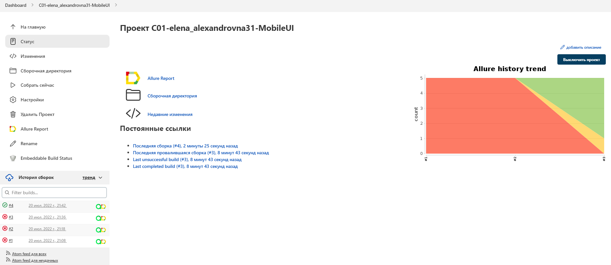
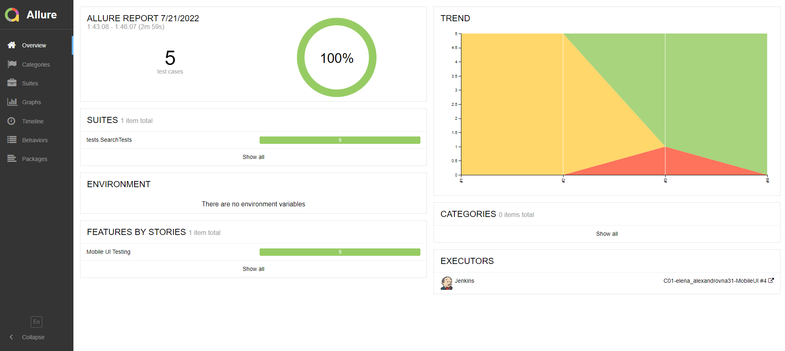
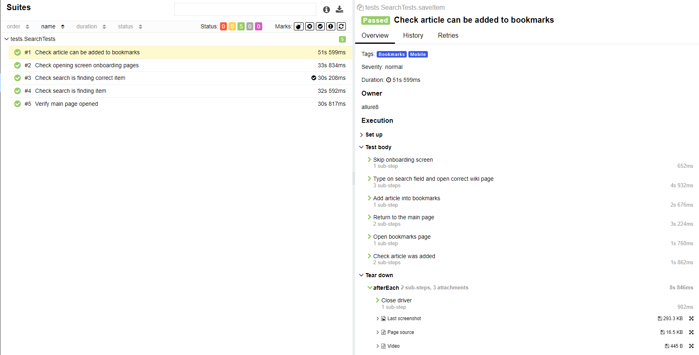
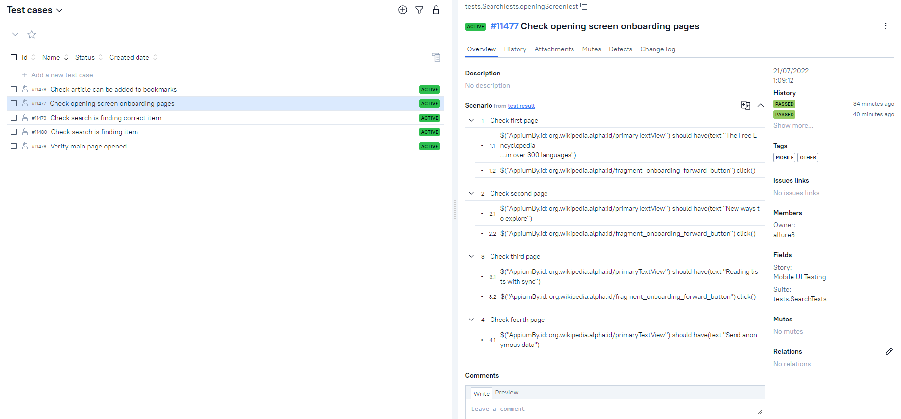
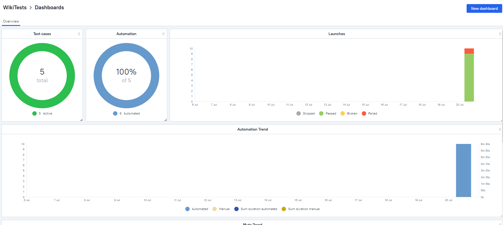
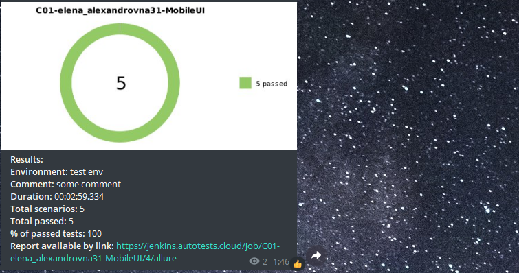

# Тестовый проект по автоматизации тестирования мобильного приложения Wikipedia. 

## :memo: Содержание:

- [Реализованные проверки](#boom-Реализованные-проверки)
- [Технологии](#classical_building-Технологии)
- [Сборка в Jenkins](#man_cook-Jenkins-job)
- [Запуск из терминала](#electron-Запуск-тестов-из-терминала)
- [Allure отчет](#bar_chart-Allure-отчет)
- [Allure TestOps](#bar_chart-alluretestops)
- [Telegram Notifications](#robot-telegram)
- [Видео пример](#video_camera-Видео)


## :boom: Реализованные проверки

- ✓ Проверки функции поиска
- ✓ Проверка экранов онбординга
- ✓ Проверка текста на стартовом экране
- ✓ Проверка добавления страницы в закладки

## :classical_building: Технологии

<p align="center">


</p>

## :man_cook: Jenkins job
</a>  <a target="_blank" href="https://jenkins.autotests.cloud/job/C01-elena_alexandrovna31-MobileUI/">Jenkins job</a>
<p align="center">
<a href="https://jenkins.autotests.cloud/job/C01-elena_alexandrovna31-MobileUI/"></a>
</p>

## :electron: Запуск тестов из терминала

```
gradle clean test -DdeviceHost=local
```

## :bar_chart: Allure-отчет
</a> Отчет в <a target="_blank" href="https://jenkins.autotests.cloud/job/C01-elena_alexandrovna31-MobileUI/4/allure/">Allure report</a>
<p align="center">
<a href="https://jenkins.autotests.cloud/job/C01-elena_alexandrovna31-MobileUI/4/allure/"></a>
</p>
<p align="center">
<a href="https://jenkins.autotests.cloud/job/C01-elena_alexandrovna31-MobileUI/4/allure/"></a>
</p>

## :bar_chart: AllureTestOps
</a> Отчет в <a target="_blank" href="https://allure.autotests.cloud/project/1487/dashboards">Allure TestOps</a>
<p align="center">

</p>
<p align="center">

</p>

## :robot: Telegram
</a> Уведомления в Telegram
<p align="center">

</p>


## :video_camera: Видео
<p align="center">
</a>
</p>
